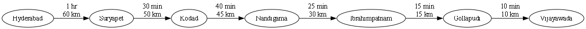

# 🛣️ Hyderabad to Vijayawada Route Visualization using Graphviz

<p align="center">
  
  
  
</p>

---

## 📌 Project Overview

This project demonstrates how to create a **route visualization** using the **Graphviz** library in Python.

The graph represents a journey from **Hyderabad** to **Vijayawada** with intermediate stops. Each route displays:

- ⏱️ Travel Time
- 📍 Distance
- ➡️ Direction of Travel

The graph is automatically generated and saved as a **PNG image**.

---

## 🚗 Route Information

| Stop | Location |
|------|----------|
| 🟢 Start | Hyderabad |
| 📍 Stop 1 | Suryapet |
| 📍 Stop 2 | Kodad |
| 📍 Stop 3 | Nandigama |
| 📍 Stop 4 | Ibrahimpatnam |
| 📍 Stop 5 | Gollapudi |
| 🔴 Destination | Vijayawada |

---

## ⏰ Travel Details

| From | To | Time | Distance |
|------|----|------|----------|
| Hyderabad | Suryapet | 1 Hour | 60 km |
| Suryapet | Kodad | 30 Minutes | 50 km |
| Kodad | Nandigama | 40 Minutes | 45 km |
| Nandigama | Ibrahimpatnam | 25 Minutes | 30 km |
| Ibrahimpatnam | Gollapudi | 15 Minutes | 15 km |
| Gollapudi | Vijayawada | 10 Minutes | 10 km |

---

# 📂 Project Structure

```
Graphviz_Route/
│
├── main.py
├── hyderabad_to_vijayawada.png
└── README.md
```

---

# ⚙️ Technologies Used

- 🐍 Python
- 📊 Graphviz

---

# 📦 Installation

### Clone Repository

```bash
git clone https://github.com/yourusername/Graphviz_Route.git
```

### Move into Project

```bash
cd Graphviz_Route
```

### Install Graphviz Package

```bash
pip install graphviz
```

> **Note:** Install the Graphviz software from https://graphviz.org/download/ and add its `bin` folder to your system PATH.

---

# ▶️ Run the Project

```bash
python main.py
```

---

# 🖼️ Output

After running the program:

```
Graph created successfully!
```

A PNG image named

```
hyderabad_to_vijayawada.png
```

will be generated.

---

# 🔄 Route Flow

```
Hyderabad
     │
     ▼
Suryapet
     │
     ▼
Kodad
     │
     ▼
Nandigama
     │
     ▼
Ibrahimpatnam
     │
     ▼
Gollapudi
     │
     ▼
Vijayawada
```

---

# ✨ Features

✅ Route Visualization

✅ Directed Graph

✅ Time Information

✅ Distance Information

✅ Automatic PNG Generation

✅ Simple Python Implementation

---

# 📸 Sample Output

> Add your generated image here.

```

```

---

# 📖 Learning Outcomes

This project helps in understanding:

- Graph Visualization
- Directed Graphs
- Graphviz Library
- Node Creation
- Edge Creation
- Edge Labels
- PNG Graph Generation

---

# 👨‍💻 Author

**Jonnadula Naga Samba Siva Rao**

Python Developer | Graphviz Learner

---

## ⭐ If you like this project

Give this repository a ⭐ on GitHub!
